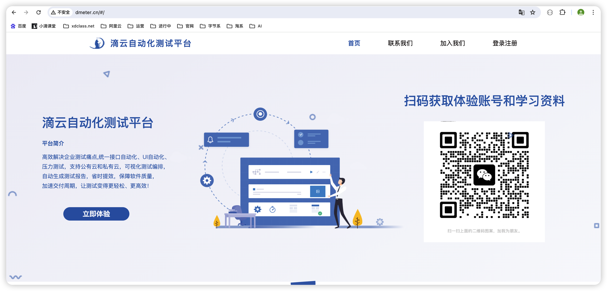
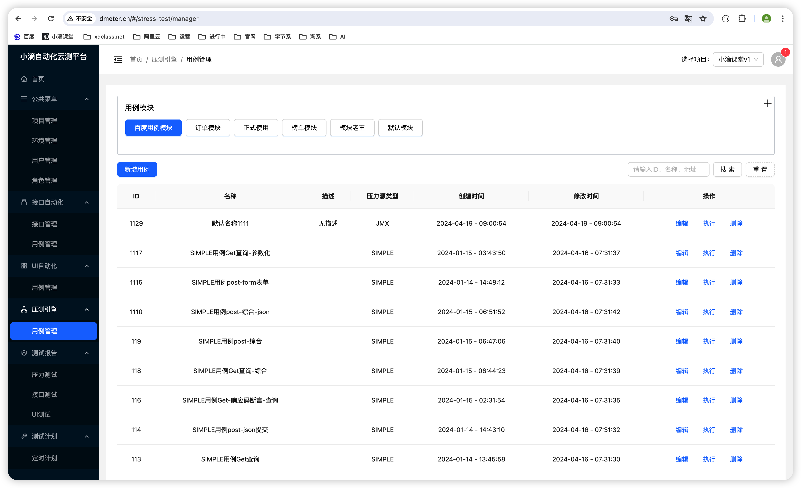
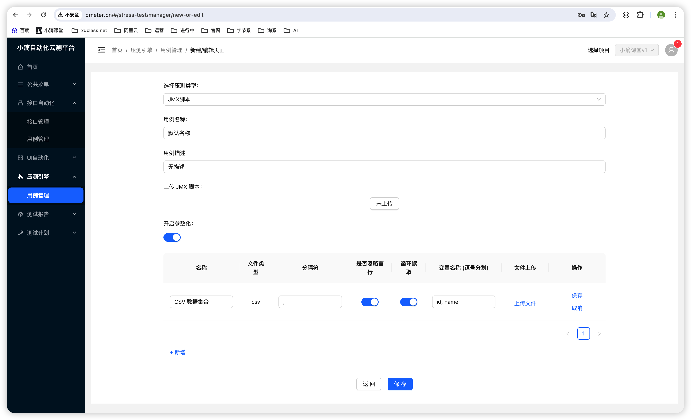
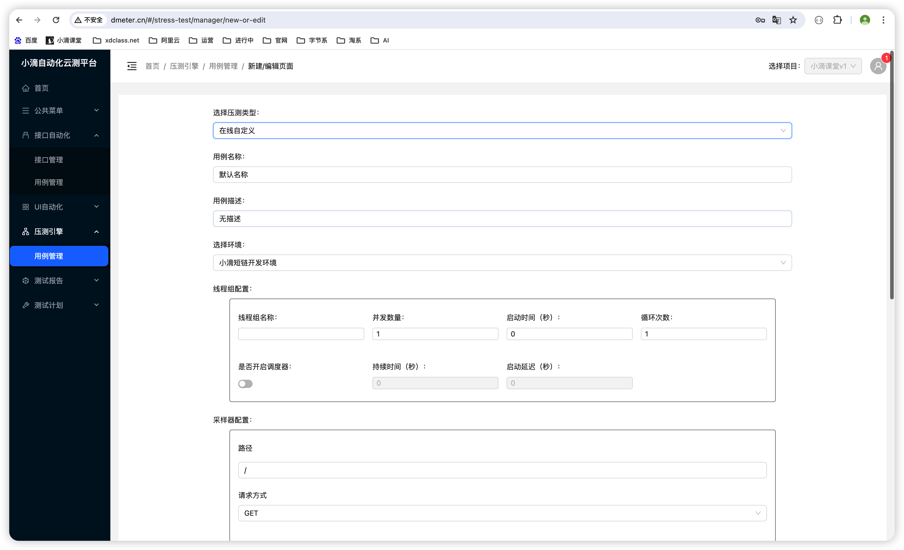
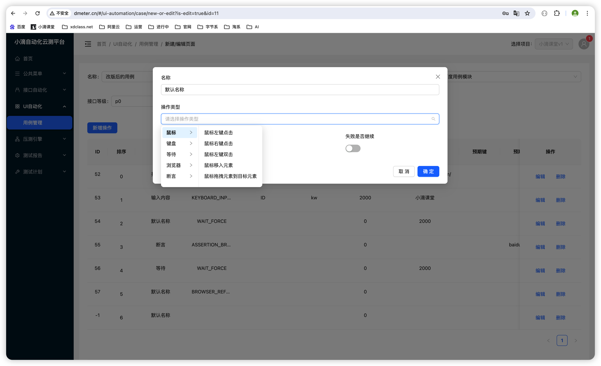
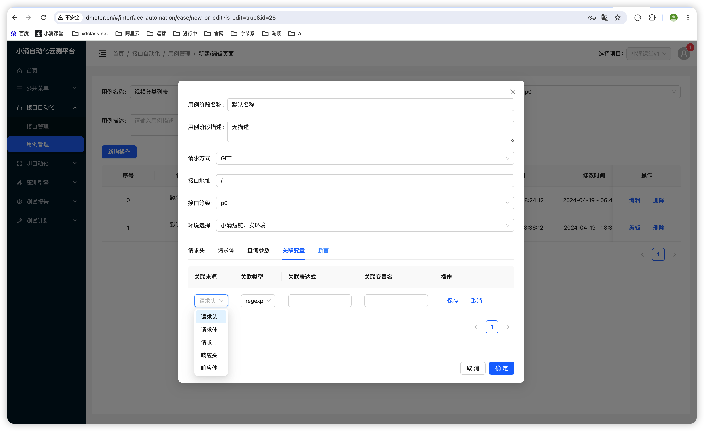

# 小滴课堂-滴云自动化测试平台-最强一站式测试平台
#### 需求背景
- 行业和公司研发开发团队普遍存在，项目开发完成上线，要多个测试人员测试对应的功能/接口等常规的测试
- 多数会用Postman、Swagger或者自己写脚本完成接口测试，包括Selenium UI自动化测试、Jmeter压力测试等
- 招聘相关测试人员进行，带来的问题就是人员成本高，测试一团乱，而且效率低，部分bug遗漏导致上线出事故
- 虽然有些测试人员会写测试脚本，但是编写脚本的过程和部署环境、准备数据的过程也耗时；
- 而且项目改了一个逻辑或者修复了一个bug，多个有模块还需要重新进行测试，效率低而且浪费公司人力；
- 简要整理几点
  - 开发和测试团队质量交付比较差
    - 每次需要本地安装一系列环境和驱动，且兼容性也差，测试和开发人员工作效率低
    - 维护多个测试工具，每次测试都需要重新部署环境、容易丢失，自动化测试脚本分散，版本不一致、维护性差
  - 本地测试、手工测试和自动化测试脚本不通用
    - 不同的测试类型需要使用不同的测试工具和技术
    - 导致测试人员需要学习和掌握多种测试方法和工具，增加了测试成本和学习成本。
  -  测试报告分散不统一
    - 在测试过程中，测试人员需要记录和整理测试结果，通常使用Excel等工具进行管理。
    - 不同测试人员使用的格式和内容可能不一致，导致测试报告分散不统一，难以汇总和分析。
  - 重复性工作过多
    - 测试过程中需要进行很多重复性的工作，如数据准备、环境配置、脚本执行等
    - 这些工作需要消耗大量的时间和精力，影响测试效率。
  - 难以发现潜在的问题
    - 手动测试存在局限性，无法覆盖所有的测试场景和用例，难以发现潜在的问题。
    - 测试脚本分散，没统一维护，测试报告历史查看不了，没有给团队沉淀积累经验

#### 云测平台介绍
自研一站式测试平台，SpringBoot3.X+AlibabaCloud+Jmeter5.X+Selenium4.X+Docker+JDK17，高效解决企业测试痛点,统一接口自动化、UI自动化、压力测试，支持公有云和私有云，可视化测试编排，自动生成测试报告；
  - 新升级技术：最新AlibabaCloud全家桶+JDK17+SpringBoot3.X+海量数据处理+超多实用java生态类库
  - 滴云自动化压测平台是全新的业务领域，独家原创项目，全网都没这个方向的视频教程，简历跳槽则独领风骚
  - 一站式自动化云测试平台，基于JMeter5.X、Selenium4.X 最新主流框架开发，解耦各个模块独立使用+定制
  - 使用云测平台DCloudTest，相当于 Postman + Swagger + Mock+ JMeter+Selenium 更加先进开发测试工具

#### 软件架构
- 基础工具环境：JDK17+IDEA2023(全新改版)+Maven3.9+Linux服务器
- 微服务技术：新版SpringCloudAlibaba全家桶+SpringBoot3.X+Nacos2.x+MybatisPlus+Mysql8.X
- 缓存+主流消息队列+分布式调度：Redis7.X+Kafak3.X-Kraft架构 + 分布式调度平台
- 底层测试引擎：Jmeter5.X+StandardJMeterEngine+Selenium4.X+WebDrvier
- 海量数据存储+自建分布式文件存储：Mysql8.0+时序数据库 + 分布式文件存储MinIO
- 可视化实时监控+告警：时序数据库InfluxDB+Grafana+Prometheus+告警监控
- 轻量级权限认证框架SaToken + 效能工具库Lombok+Hutool+高性能Excel处理工具EasyExcel
- 高性能序列化组件Xstream+ 最好的JAVA生态压缩库ApacheCommonsCompress+更多...
- 前后端分离架构下的 Vue3+ AntDesign+ 丰富可视化图形报表 (提供完整代码)
- DevOps上线部署：Jenkins CICD + 阿里云Git仓库+ 阿里云ECS 服务器+ Docker容器编排调度

  - 全新升级技术：最新AlibabaCloud全家桶+JDK17+SpringBoot3.X+海量数据处理+超多实用java生态类库
  - 滴云自动化压测平台是全新的业务领域，独家原创项目，全网都没这个方向的视频教程，简历跳槽则独领风骚
  - 一站式自动化云测试平台，基于JMeter5.X、Selenium4.X 最新主流框架开发，解耦各个模块独立使用+定制
  - 使用云测平台DCloudTest，相当于 Postman + Swagger + Mock+ JMeter+Selenium 更加先进开发测试工具

#### 核心模块和解决方案
- P3（提升技术广度-稳固基础设施）
  - 云测平台多账号登录体系数据库设计和编码实现，支持手机-邮箱-社交账号
  - 最火的轻量级权限认证框架SaToken+整合AlibabaCloud微服务
  - 业务数据隔离控制/项目空间/模块管理/接口管理+ 变更实时自动同步
  - AlibabaCloud微服务划分/工程搭建/代码管理/编码规范扫描
  - 中间件一键部署Kafka3.X/Redis7.X/Mysql8.X/MinIO/时序数据库/Prometheus等
  - 可视化实时监控+告警，时序数据库InfluxDB+Grafana+Prometheus

- P2（技术驱动业务发展-难点攻克）
  - 大厂项目管理中的工时评估方法论和新领域项目风险把控技巧
  - 源码封装StandardJMeterEngine自定义压测引擎实战
  - 本地上传JMX结合压测引擎和动态生成压测脚本实战
  - 云端压测生成可视化HTML压测报告和多文件打包压缩下载实战
  - 自定义在线压测聚合报告统计分析和性能测试报告在线分享
  - 支持HTTP多方法测试在线Web端接口测试工具和响应结果可视化
  - 在线API接口自动化测试和可视化拖拽多接口场景编排测试
  - 数据驱动测试，支持多文件格式参数导入和数据库参数读取
  - 从0到1设计公司自己的自动化接口测试框架和可视化的断言
  - SpringBoot3.X二次封装Selenium静默执行和快照截图存储
  - 支持丰富的UI自动化测试报告和多维度测试指标分析
  - 前后端分离架构,基于前端主流框架+UI库+可视化图形报表 +联调+前端部署上线

- P1（架构综合能力-技术深度-核心板块攻坚）
  - 掌握架构分析方法论，基于团队技术和业务需求推断最合适的方案
  - 滴云自动化压测平台架构设计和多架构图分层绘制
  - 新版SpringBoot3.X集成Jmeter5.X 技术多解决方案分析和业务选择
  - SpringBoot3.X二次封装Jmeter源码实现自定义压测结果收集上报
  - 深入Jmeter压测链路+java自定义创建测试计划/线程组/循环控制器/采样器
  - 自定义ResultCollector整合Kafak实时收集数据和持久化存储
  - 大型自动化云测平台Mysql数据库模型设计和SQL索引优化实战
  - 海量数据存储技术选择和数据库执行计划分析+性能优化实战
  - 自动化多接口关联测试和上下文接口数据提取实战
  - Selenium4.X UI自动化测试引擎整合SpringBoot3.X封装组件
  - UI自动化元素库管理，支持多种DOM元素提取和持久化存储
  - 零代码或者低代码整合Selenium 浏览器自动化测试，高度可复用的测试脚本
  - Selenium Web端UI自动化测试场景编排，一键启动自动化测试
  - 技术Leader方法论和团队管理技巧、技术面试官成长法则
  - 自动化云测平台上线服务器资源评估和文件数据清理归档实战
  - DevOps自动化部署 Jenkins CICD + 阿里云Git仓库+ 阿里云ECS 服务器+ Docker容器编排调度
  - 技术组长或高级工程师简历编写和面试回答

#### 界面功能说明

压测引擎介绍-本地jmeter的jmx直接上传

压测引擎介绍-在线创建测试计划

WebUI自动化测试- Selenium4.X+Java封装，0代码实现自动化测试

接口自动化测试-支持多接口编排和参数依赖提取+传递

#### 安装教程

代码已经全部开发好，需要的联系我即可, 微信【xdclass6】

#### 使用说明

#### 参与贡献

1.  Fork 本仓库
2.  新建 Feat_xxx 分支
3.  提交代码
4.  新建 Pull Request

